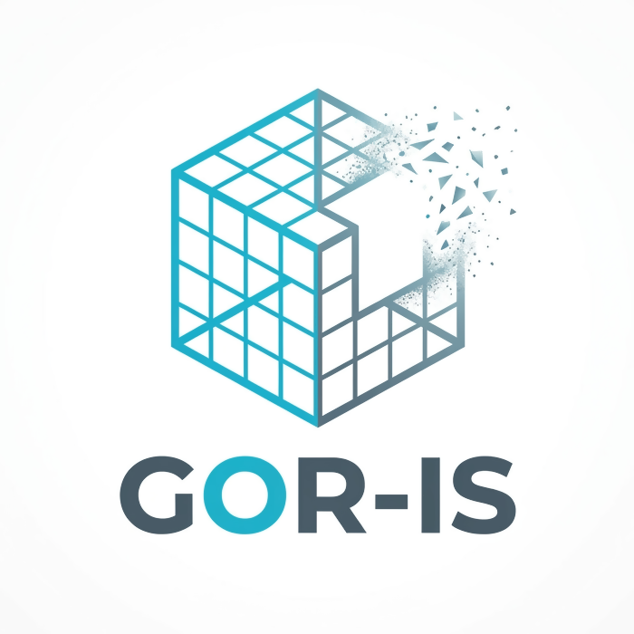
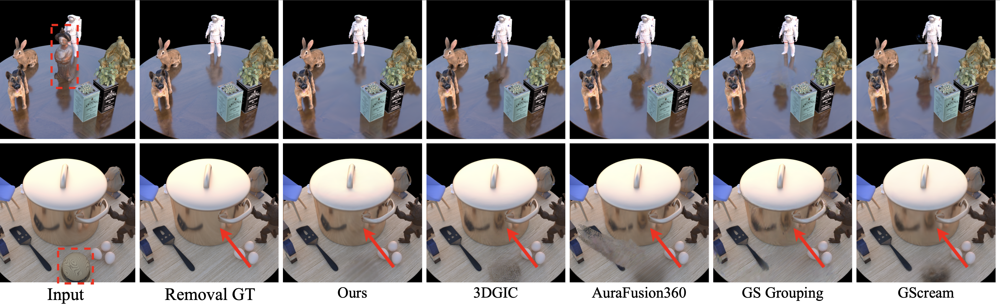
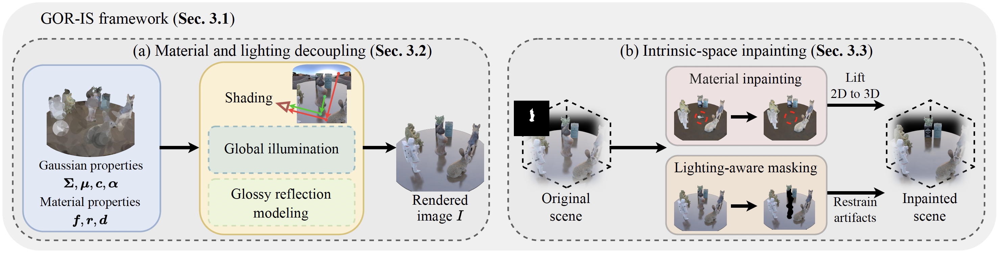
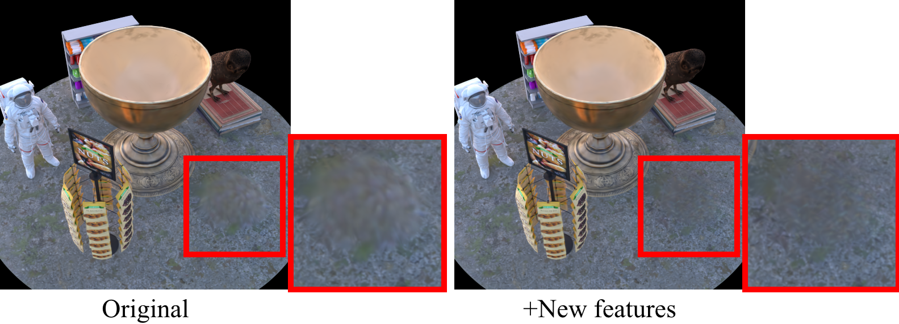

<div align="center">
<h1>
GOR-IS: 3D Gaussian Object Removal in the Intrinsic Space<br><sub>CVPR 2026 Highlight</sub>
</h1>
  <a href="https://applezyh.github.io/GOR-IS-project-page/static/pdfs/GOR-IS-paper.pdf" target="_blank" rel="noopener noreferrer">
    
    </a>
  <a href="https://applezyh.github.io/GOR-IS-project-page/">
    </a>
  <a href="https://huggingface.co/datasets/applezyh/GOR-IS-datasets" target="_blank">
    
    </a>
  <a href="https://pan.baidu.com/s/1JckAz6uxNZe7hKqIVTnjUA?pwd=nf5r" target="_blank">
    
    </a>
</div>


<div align="center">
  <p>
    <a href="https://github.com/applezyh">Yonghao Zhao</a><sup>1</sup>, 
    Yupeng Gao<sup>2</sup>, 
    <a href="http://www.patternrecognition.asia/jian/">Jian Yang</a><sup>1, 2</sup>, 
    <a href="https://csjinxie.github.io/">Jin Xie</a><sup>2*</sup>, 
    <a href="https://wangningbei.github.io/">Beibei Wang</a><sup>2*</sup>
  </p>
  <p>
    <sup>1</sup>Nankai University &nbsp;&nbsp;
    <sup>2</sup>Nanjing University
  </p>
  <p>
    <sup>*</sup>Corresponding author
  </p>
</div>


We propose GOR-IS, a novel framework that enhances both the physical consistency and visual coherence of 3D object removal. As shown in the examples, our method simultaneously removes the target object (red dashed box) and its corresponding reflection, while naturally inpainting the region previously occluded by the object. In contrast, existing approaches such as [3DGIC](https://peterjohnsonhuang.github.io/3dgic-pages/), [AuraFusion360](https://kkennethwu.github.io/aurafusion360/), [GS Grouping](https://ymq2017.github.io/gaussian-grouping) and [GScream](https://w-ted.github.io/publications/gscream/) overlook global lighting effects, leading to physically inconsistent removal.

## ✨Overview


**Overview of the GOR-IS framework.** We use 3DGS with extended material properties as the basic 3D representation, combined with a global illumination model, to decompose the scene into its material and lighting components. This decomposition enables explicit light transport modeling, ensuring consistent global lighting effects. Furthermore, we introduce a specially designed module for glossy reflection modeling. Building upon this, we propose an intrinsic-space inpainting module to maintain the consistent appearance of scene inpainting. This module includes a material inpainting module that effectively restores non-Lambertian surfaces using view-independent material properties, along with a lighting-aware masking mechanism that suppresses reflection-induced blurry artifacts.

## 🪧 Checklist

- [x] Release the code
- [x] Release the GOR-IS-Synthetic and GOR-IS-Real datasets
- [x] Release an additional real-world dataset compiled from existing datasets
- [x] Release an additional synthetic dataset containing two new scenes with more complex inpainting textures

## 🆕 New Features

1. **Improved inpainting mask generation.**

    Extends the previous strategy by leveraging object bounding boxes to identify fully occluded regions, ensuring robust handling of complex-occlusion, multi-object scenes.

2. **Enhanced reference viewpoint selection.**

    Previous: Top-3 candidate views were selected based on inpainting mask area.

    Present: evaluate triplet image matching within the top-10 candidate views and select the most consistent set, improving cross-view coherence.

3. **Adjusted hyperparameter settings.**

    Adjusts the decay strategy for the normal loss and the weight of the 3D inpainting loss.

4. **Comparison on the GOR-IS-Synthetic dataset.**

    

    | Methods       | PSNR      | SSIM      | LPIPS     | FID      | M-LPIPS   | M-FID    |
    | ------------- | --------- | --------- | --------- | -------- | --------- | -------- |
    | Original      | 31.91     | **0.947** | **0.039** | 23.4     | 0.060     | 65.0     |
    | +New features | **31.99** | **0.947** | **0.039** | **23.3** | **0.050** | **62.5** |


## 🔧 Installation

```bash
# Clone the repository (including submodules)
git clone https://github.com/applezyh/GOR-IS.git --recursive

# Create and activate the conda environment
conda create -n goris python=3.12
conda activate goris
pip install requirements.txt
pip install submodules/diff-gaussian-rasterization
pip install submodules/simple-knn
```

Next, install [**nvdiffrast**](https://github.com/NVlabs/nvdiffrast) by following the instructions in its official repository.

Finally, install **gtracer** from the provided submodule:

```bash
cd submodules/gtracer

# use cmake to build the project for ptx file (for Optix)
rm -rf ./build && mkdir build && cd build && cmake .. && make && cd ../

# Install the package
pip install .
```
Please note that we have made necessary modifications to **gtracer**. For compatibility, kindly use the version provided in `./submodules` for installation.

## 📊 Dataset ([Hugging Face](https://huggingface.co/datasets/applezyh/GOR-IS-datasets)) ([Baidu Netdisk](https://pan.baidu.com/s/1JckAz6uxNZe7hKqIVTnjUA?pwd=nf5r))
We provide a comprehensive suite of datasets, including our proposed **GOR-IS-Synthetic** and **GOR-IS-Real**, along with additional real-world scenes (**Additional-Real**) sourced from Mip-NeRF 360 and Ref-Real, and synthetic scenes (**Additional-Synthetic**) featuring more complex inpainting textures. All datasets are fully preprocessed and contain the necessary components for our framework, enabling users to directly download, decompress, and use them without additional setup.

The organization of the datasets is as follows:
```sh
GOR-IS-datasets/
├── gor-is-synthetic/
│   ├── scene_1_colmap/
│   │   ├── images/ # input images
│   │   ├── object_mask/ # masks of target objects
│   │   ├── specular_mask/ # masks of specular regions
│   │   ├── sparse/ # COLMAP data
│   │   ├── normal/ # predicted normals
│   │   ├── train_list.txt
│   │   ├── val_list.txt
│   │   └── test_list.txt
│   ├── scene_2_colmap/
│   │   └── ...
│   └── ...
│
├── gor-is-real/
│   ├── ...
│
├── additional-real/
│   ├── ...
│
├── additional-synthetic/
│   ├── ...
```

## 🚀 Running the code
```sh
bash run.sh # see run.sh for more details
```

If you have any questions, please submit a GitHub issue or email **applezyh@outlook.com**.

## 🙏 Acknowledgements
Thanks to these great repositories: [RaDe-GS](https://github.com/HKUST-SAIL/RaDe-GS), [2DGS](https://github.com/hbb1/2d-gaussian-splatting), [3DGS](https://github.com/graphdeco-inria/gaussian-splatting), [gtracer](https://github.com/fudan-zvg/gtracer) and many other inspiring works in the community.

## 📄 License

See the [LICENSE](./LICENSE) file for details about the license under which this code is made available.

## 🏷️ Citation

If you find our work is helpful, please consider citing:
```bibtex
@inproceedings{zhao2026gor-is,
  title={GOR-IS: 3D Gaussian Object Removal in the Intrinsic Space},
  author={Yonghao Zhao and Yupeng Gao and Jian Yang and Jin Xie and Beibei Wang},
  booktitle={Proceedings of the IEEE/CVF Conference on Computer Vision and Pattern Recognition},
  year={2026}
}
```
